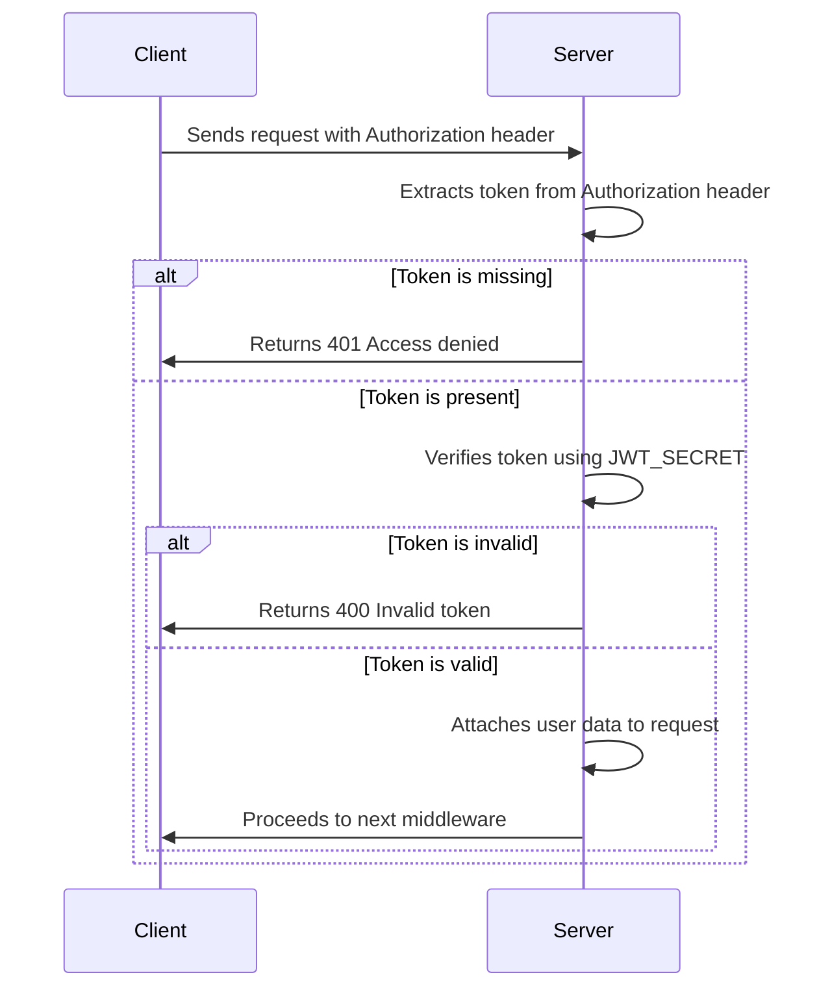

## authMiddleware

```js
const authMiddleware = (req, res, next) => {
  const token = req.header("Authorization")?.replace("Bearer ", "");

  if (!token) return res.status(401).send("Access denied");

  try {
    const decoded = jwt.verify(token, process.env.JWT_SECRET);
    req.user = decoded; // Attach user data to request
    next();
  } catch (err) {
    res.status(400).send("Invalid token");
  }
};
```


