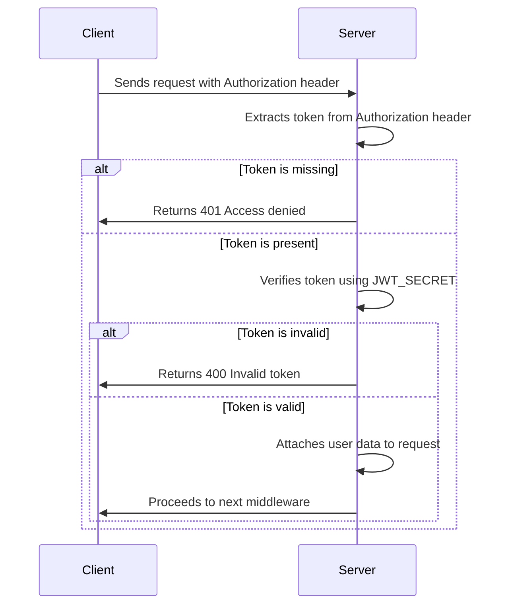
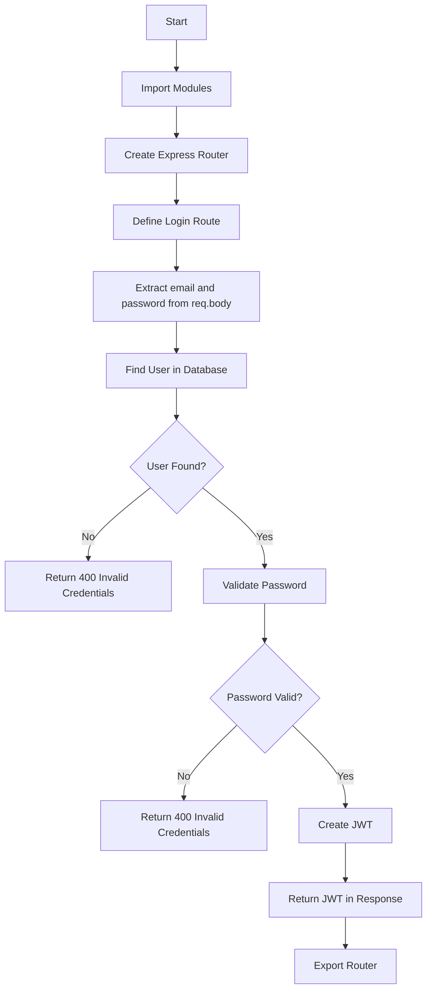

## authMiddleware

```js
const authMiddleware = (req, res, next) => {
  const token = req.header("Authorization")?.replace("Bearer ", "");

  if (!token) return res.status(401).send("Access denied");

  try {
    const decoded = jwt.verify(token, process.env.JWT_SECRET);
    req.user = decoded; // Attach user data to request
    next();
  } catch (err) {
    res.status(400).send("Invalid token");
  }
};
```



## auth Route

```js
import express from 'express';
import jwt from 'jsonwebtoken';
import bcrypt from 'bcryptjs';
import db from '../config/db.js';

const router = express.Router();

// Login route
router.post('/login', async (req, res) => {
  const { email, password } = req.body;

  // 1. Find user
  let user;
  try {
    user = await db.collection('users').findOne({ email });
  } catch (error) {
    return res.status(500).send('Server error');
  }
  if (!user) return res.status(400).send('Invalid credentials1');

  // 2. Validate password
  const isValid = await bcrypt.compare(password, user.password);
  if (!isValid) return res.status(400).send('Invalid credentials2');

  // 3. Create JWT
  const token = jwt.sign(
    { id: user._id, email: user.email },
    process.env.JWT_SECRET,
    { expiresIn: '1h' }
  );

  res.json({ token });
});

export default router;
```

